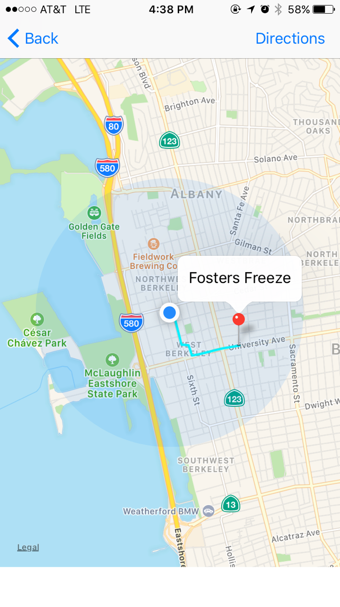

# iceCream

## Name of Application
Ice Cream New Me
## Project Owner
Jon Miguel Jara
## Purpose
iOS app the locates the nearest ice cream shop according to the user's location. 

## Features
* 'Ice Cream' buttom refreshes locations and updates new closest shop
* only shows ice cream shops that are currently open to the user
* Renders the fastest route to the ice cream shop

## Implementation
App uses MkMapView to display map to the user + MkMapAnnoation to show where the closest ice cream. Restaurant data is pulled through Foursquare API and parsed using SwiftyJSON. 

## Screen Shots

